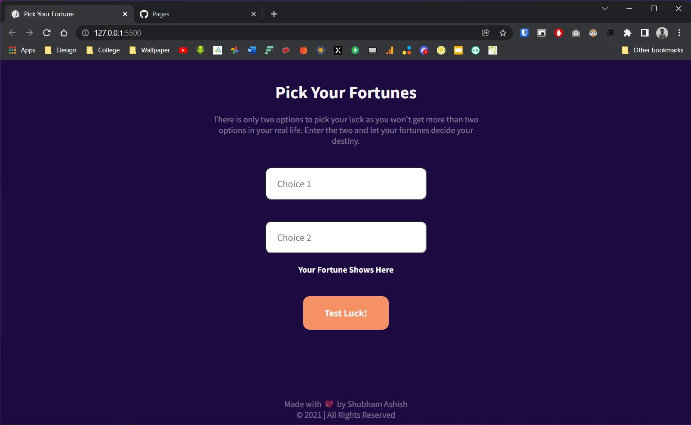

# Pick-ur-fortune
A simple website to randomly choose choices your confuse with. Just like **flipping a coin** but in digital and minimal way \
[Visit Here🚀](https://shubhamashish33.github.io/Pick-ur-fortune/)

## Screenshot 📱

## Tech and Language ⚙️
- HTML
- Vanilla CSS
- JavaScript

## Links 🔗

**If you like this content don't forget to mark it as star. \
Do Follow me on Twiiter to know behind the process.** 
